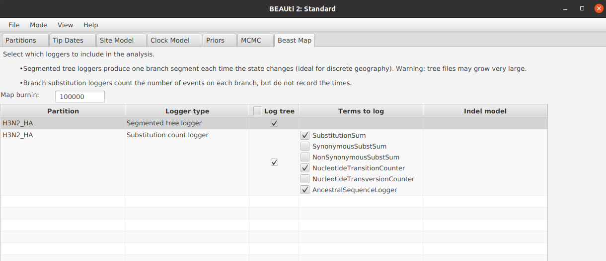
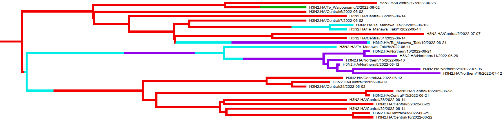
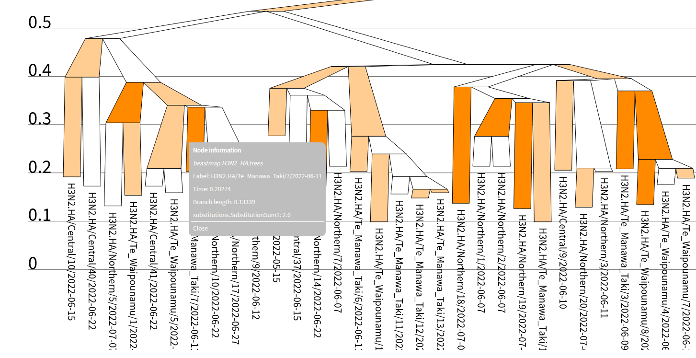
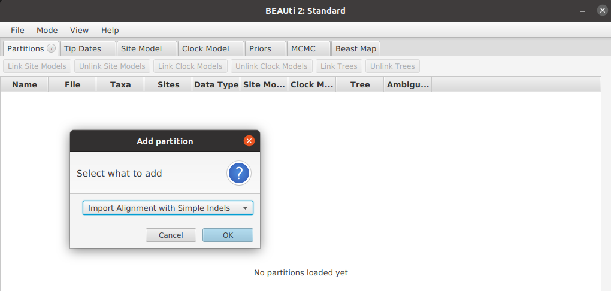
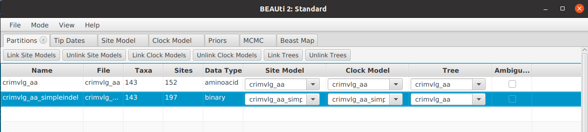
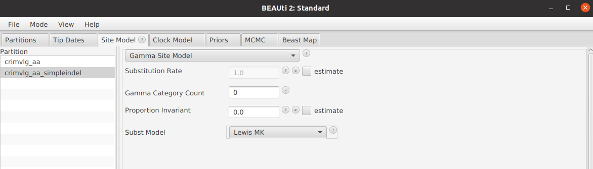
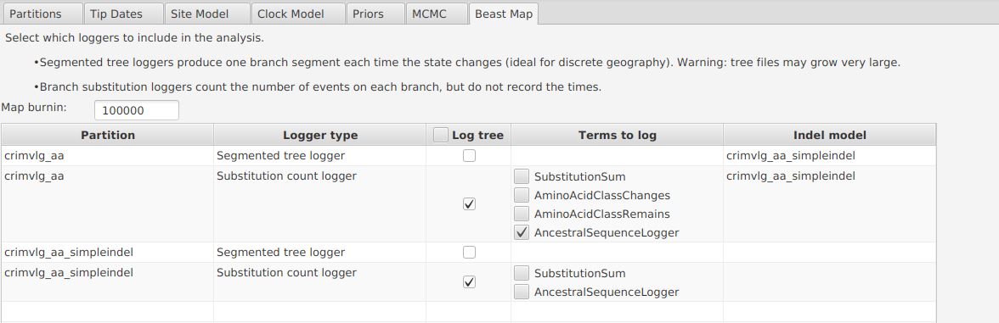
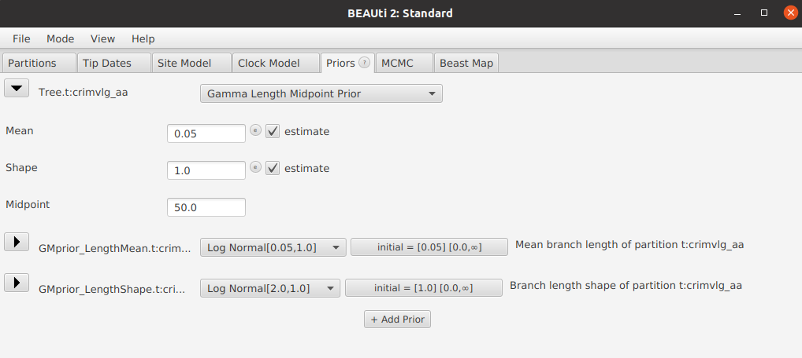

# BeastMap
A BEAST 2 package for reconstructing ancestral sequences and substitution histories. The method first performs ancestral sequence reconstruction on the internal nodes, and then uses stochastic mapping to sample a substitution pathway along each branch. This all happens during MCMC. This package is compatible with a wide range of BEAST 2 site, clock, and tree models; and discrete data types (including nucleotide, codon, amino acid, 3Di, morphological, cognate, phoneme, and geographical). BeastMap will also take care of insertions and deletions.


## Installation

BeastMap is currently in pre-release. 

1.  Launch BEAUti
2.  Click on `File -> Manage Packages`
3.  Install BeastMap. If BeastMap is not in the list of packages, you may need to add an extra package repository as follows:

-   Click the packager repositories button. A dialog pops up.
-   Click the Add URL button. A dialog is shown where you can enter  [https://raw.githubusercontent.com/CompEvol/CBAN/master/packages-extra-2.7.xml](https://raw.githubusercontent.com/CompEvol/CBAN/master/packages-extra-2.7.xml)
-   click the OK button. There should be an extra entry in the list.
-   click Done
-   After a short delay, BeastMap should appear in the list of packages.


## Setting up stochastic mapping using BEAUti


Set up a BEAST 2 analysis as per usual. After the partitions have been finalised, configure the stochastic mapping with the `Beast Map` tab. Note that this will not change any of the results or the phylogenetic model, but it will add new information to the logged files. These loggers can be further modified in the `MCMC` tab. There is also BEAUti support for BeastMap in [StarBeast3](https://github.com/rbouckaert/starbeast3).


The `Log tree` column will add these terms to the trees (per branch), while the `Term to log` column will report the terms to include in the logger file. Some of these terms will also be included in the trace log (summed across all branches).


The first `burnin` steps of the MCMC chain will not have any stochastic mapping. This is not only to minimise computational overhead during burnin, but also because the initial states of the chain often present numerical issues due to long branches and high rates.





A **segmented tree logger** will produce a tree containing one branch segment every time the sequence/state changes. This is useful for geographical analyses, but is not recommended for long sequences with many substitutions, as there will be a large number of ancestral sequences or states, and therefore the tree files may require a large amount of disk space.


Shown below is a segmented tree, where branches/segments are coloured by geographical location. This tree is easily visualised using [IcyTree](https://www.icytree.org).




A **substitution count logger** (further detailed in [doc](doc/)) will not report the timing of change events along each lineage, but it can report the ancestral sequence/state of each node, and the events between each node and its parent (e.g. total number of changes along the branch). 

Shown below is a tree with branches coloured by the number of substitutions (ranging from 0 to 2 here).




## Ancestral sequence reconstruction and indels using BEAUti


Insertions and deletions (indels) are usually overlooked in phylogenetics. In a standard BEAST 2 analysis, gaps (the - symbol) are treated as missing data and are effectively ignored from the likelihood calculation. However, this can present problems when reconstructing ancestral sequences and substitution pathways, and will lead to a biased estimate. Using BeastMap, you can treat gaps as a binary data type, as a partition alongside the main amino acid / nucleotide partition. 


1. Open BEAUti

2. Drag and drop an alignment file onto BEAUti and select `Import Alignment With Simple Indels` (or alternatively press `File` and then `Import Alignment With Simple Indels`). Select an alignment file and its data type, as per usual. 





3. If there are gaps in the alignment, we should have two partitions now, sharing the same tree. The `simpleindel` partition is a binary representation of gaps using the Simple Indel Coding method described by Simmons and Ochoterena 2000. This representation does not treat each gap as an independent site, but rather it joins together contiguous gapped positions into the same indel event. Observe that the number of sites will be different in the indel alignment compared with the main one.




4. In the `Site Model` tab, the indel substitution model will be restricted to binary data models, such as the Lewis MK model from the [MM package](https://github.com/CompEvol/morph-models). Whereas, the main character alignment (e.g. amino acids or nucleotides) will have its usual choice of substitution models.





5. Configure the clock models in the `Clock Model` tab. By default, the main partition will have its clock rate fixed to 1, while the indel alignment will have its relative clock rate estimated.


6. Open the `Beast Map` tab. Enable the tree log for either the amino acid or indel tree (the other box will automatically be selected because they have the same tree). Check the `AncestralSequenceLogger` box on the amino acid partition. Observe that the indel partition has been correctly identified in the rightmost column of this table.  

 

7. Save the XML file and run BEAST 2, as per usual. The beastmap trees file will contain ancestral sequences, and these sequences will have gaps reconstructed under the indel model. If you chose to record the number of substitutions in the previous step, these terms should be smaller because the gaps are now being accounted for. 


## Setting up a gamma-length midpoint tree prior using BEAUti


Although time trees (e.g. birth-death, coalescent) may be preferrable over substitution trees in many biological datasets, if you are interested in using the unconstrained gamma-length midpoint (GM) tree prior, follow the steps below. This may serve as a useful null hypothesis to test whether time trees are indeed appropriate. In this tree prior, branch lengths are independently sampled from a gamma distribution. The tree is rooted using a Bayesian extension of the midpoint method. 


1. Open BEAUti
2. Load the data and set up partitions and site models, as per usual.
3. It is recommended to use a strict clock in the `Clock Model` tab. A relaxed or local clock will not be identifiable with the tree.
4. Open the `Priors` tab and select `Gamma Length Midpoint Prior` from the tree dropdown.




5. The `Midpoint` constant will determine where the root should lie on the longest path between the furtherest pair of tips. path. Specifically, the root is assumed to lie 0 < F < 1 along this path, where F ~ beta(Midpoint, Midpoint). If this term is 50, then we expect the midpoint to lie between 40-60% of the way along this path (with 95% probability). If this term is 1, then the root is equally likely to lie anywhere on the path.

6. The `GMprior_LengthMean` parameter is the average branch length (under a gamma distribution prior).

7. The `GMprior_LengthShape` parameter is the shape of branch lengths (under a gamma distribution prior).

8. Optionally, open the `Beast Map` tab to also do stochastic mapping on this tree.

9. Save the XML file and run in BEAST 2, as per usual.


## Summarising a segmented tree

Summarise a posterior distribution of segmented trees onto a summary tree using:

```
# Generate a summary tree first
~/beast/bin/TreeAnnotator tree.trees summary.nexus

# Then map the segments onto the summary tree
~/beast/bin/applauncher SegmentedTreeAnnotator -tree summary.nexus -segments beastmap.segments.trees -out segments.nexus 
```


## Examples

There are some XML files in the [examples](examples) folder. Also see the [simulation](simulation) folder for some simulation studies and codon partion models (currently these cannot be configured using BEAUti).


*Influenza*. `H3N2_NewZealand.xml` and its input file `H3N2_HA.fasta`  describe a discrete phylogeographical analysis based on the haemagglutinin segment sequenced from 96 cases of influenza A(H3N2) in New Zealand. This dataset was downsampled from over 1000 complete genomes produced by Jelley at al. 2025. **Package dependencies:**  BEAST CLASSIC, SSM


*Anticodon binding domain*. `CRIMVLG.xml`  and its input files `crimvlg_aa_trimmed.fasta` and `crimvlg_3di_trimmed.fasta`. This analysis uses three data types on a single tree: both amino acids, 3Di characters, and indels. **Package dependencies:**  FoldBeast, OBAMA, ORC


## Known BEAUti issues


- Please finalise all partitions in the `Partitions` tab before configuring the `Beast Map` tab. For example, If a partition is removed after stochastic mapping has been enabled on it, there may be unexpected issues. 

- When using the segmented tree logger, please ensure that the taxon names are primarily alphanumeric, with no non-ascii characters and none of the following symbols, or it can interfere with newick parsing: ][)(:;!@#$%^&*


## References


Jelley, L., Douglas, J., Allais, M., Wang, J., O'Neill, M., ... & Huang, Q. S., Geoghegan, J.,  (2025). A decade of genomic surveillance tracks the disappearance and reintroduction of seasonal influenza virus in Aotearoa New Zealand.  https://doi.org/10.21203/rs.3.rs-7503135/v1


Simmons, M. P., & Ochoterena, H. (2000). Gaps as characters in sequence-based phylogenetic analyses. Systematic biology, 49(2), 369-381.
