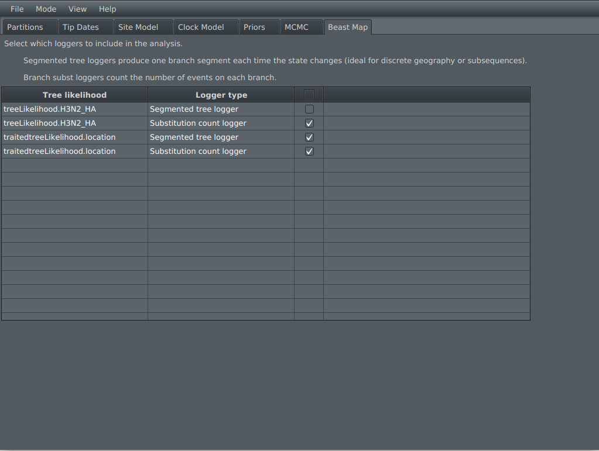

# BeastMap
A BEAST 2 package for counting the number of synonymous, non-synonymous, and indel mutations on each branch. The method first performs ancestral sequence reconstruction on the internal nodes, and then uses stochastic mapping to sample a mutation pathway along each branch. This all happens during MCMC. This package is compatible with a wide range of existing BEAST 2 site, clock, and tree models; and discrete data types (including nucleotide, codon, amino acid, 3Di, morphological, cognate, phoneme, and geographical).


## Installation

BeastMap is currently in pre-release. 

1.  Launch BEAUti
2.  Click on `File -> Manage Packages`
3.  Install BeastMap. If BeastMap is not in the list of packages, you may need to add an extra package repository as follows:

-   Click the packager repositories button. A dialog pops up.
-   Click the Add URL button. A dialog is shown where you can enter  [https://raw.githubusercontent.com/CompEvol/CBAN/master/packages-extra-2.7.xml](https://raw.githubusercontent.com/CompEvol/CBAN/master/packages-extra-2.7.xml)
-   click the OK button. There should be an extra entry in the list.
-   click Done
-   After a short delay, BeastMap should appear in the list of packages.


## Setting up stochastic mapping using BEAUti


Set up a BEAST 2 analysis as per usual. Then at the very end, configure the stochastic mapping with the `Beast Map` tab. This will work on a range of datatypes, including nucleotide, amino acids, 3Di characters, and discrete traits/locations.

A **segmented tree logger** will produce a tree containing one branch segment every time the sequence/state changes. This is useful for geographical analyses, but is not recommended for long sequences with many mutations, as there will be a large number of states, and therefore the tree files may require a large amount of disk space.

A **substitution count logger** (further detailed in the next section) will not report the timing of change events along each lineage, but it will summarise the events between each node and its parent (e.g. total number of changes along the branch). There is currently limited BEAUti support for this logger, which will only report the total number of changes and none of the other utilities below, which require XML file editing at this stage.




The `Tree logger` column will add these terms to the trees (per branch), while the `Term to count` column will report the sum the terms up in the log file (summed across all branches).


These loggers can be further modified in the `MCMC` tab.

The first `burnin` steps of the MCMC chain will not have any stochastic mapping. This is because the initial states of the chain often present numerical issues due to very branches and high rates.

There is also BEAUti support for BeastMap in [StarBeast3](https://github.com/rbouckaert/starbeast3).


## Subsitution counters

Each counter shares a common ```BranchMutationSampler``` for any given tree likelihood, which will stochastically sample the mutations at the time of logging. This ensures that the various mutation summarisers below will be in harmony.


### SubstitutionSum
Counts the total number of substitutions per branch.

```<sampler spec="beastmap.logger.mut.SubstitutionSum" sampler="@mutationsampler" />```

### SynonymousSubstSum
Counts the total number of synonymous substitutions per branch. Requirements: **nucleotide** or **codon** data. Options: code (default: universal); readingFrame (default: 1).

```<sampler spec="beastmap.logger.mut.SynonymousSubstSum" sampler="@mutationsampler" code="universal" readingFrame="1"/>```

### NonSynonymousSubstSum
Counts the total number of non-synonymous substitutions per branch. Requirements: **nucleotide** or **codon** data. Options: code (default: universal); readingFrame (default: 1).

```<sampler spec="beastmap.logger.mut.NonSynonymousSubstSum" sampler="@mutationsampler"  code="universal" readingFrame="1"/>```

### FromToSubstSum
Counts the total number of substitutions per branch from one of the characters in state X to one of the characters in state Y (user defined). Options: from (e.g. 'A' or 'AG'); from (e.g. 'C' or 'ACG').

``` <sampler spec="beastmap.logger.mut.FromToSubstSum" sampler="@mutationsampler" from="A" to="CG" />```

### NucleotideTransitionCounter
Counts the total number of transitions per branch (purine to purine or pyrimidine to pyrimidine). Requirements: **nucleotide** data.

``` <sampler spec="beastmap.logger.mut.NucleotideTransitionCounter" sampler="@mutationsampler" />```

### NucleotideTransversionCounter
Counts the total number of substitutions per branch (purine to pyrimidine or vice versa). Requirements: **nucleotide** data.

``` <sampler spec="beastmap.logger.mut.NucleotideTransitionCounter" sampler="@mutationsampler" />```


### AminoAcidClassChanges
Counts the total number of amino acid substitutions per branch such that the amino acid chnages to a different functional class. Requirements: **amino acid** data. These classes are based on the BLOSUM62 matrix non-polar: {IVLM}, amide/amine: {DENQ}, basic: {HKR}, aromatic: {FWY}, small/polar: {AST}, cysteine: {C}, glycine: {G}, proline: {P}.

``` <sampler spec="beastmap.logger.mut.AminoAcidClassChanges" sampler="@mutationsampler" />```


### AminoAcidClassRemains
Counts the total number of amino acid substitutions per branch such that the amino acid remains in the same functional class. Requirements: **amino acid** data.

``` <sampler spec="beastmap.logger.mut.AminoAcidClassRemains" sampler="@mutationsampler" />```


### SubstitutionSummer

Takes one of the other per-branch counters and adds all the numbers together across the whole tree

``` <log spec="beastmap.logger.SubstitutionSummer" counter="@ID_OF_COUNTER"  />```


## Filters

Any of the counters can be filtered to a certain range of sites. In the exampkle below, we will only count the substitutions in sites 1-10. 

```<sampler spec="beastmap.logger.mut.SubstitutionSum" sampler="@mutationsampler" filter="1-10" />```


## Setting up counters in XML

At every log, the ancestral sequence of each internal node will be stochatsically sampled, and so will the mutations along each branch. These mutations are summarised by the following loggers.

Append the following loggers to the bottom of the XML file to count the number of substitutions along each branch in the tree logger. In this example, the trees will be logged with length `SubstitutionSum` but you can leave in default units by removing the `lengths` input.
```
  <logger id="treelog" spec="Logger" fileName="substitution.trees" logEvery="10000" mode="tree">
      <log id="SampledSubstTreeLogger" spec="beastmap.logger.SampledSubstTreeLogger" lengths="@SubstitutionSum" tree="@tree">
          <sampler id="SubstitutionSum" spec="beastmap.logger.mut.SubstitutionSum" sampler="@mutationsampler" />
          <sampler id="SynonymousSubstSum" spec="beastmap.logger.mut.SynonymousSubstSum" sampler="@mutationsampler" code="universal" readingFrame="1"/>
          <sampler id="NonSynonymousSubstSum" spec="beastmap.logger.mut.NonSynonymousSubstSum" sampler="@mutationsampler"  code="universal" readingFrame="1"/>
          <sampler id="FromToSubstSum" spec="beastmap.logger.mut.FromToSubstSum" sampler="@mutationsampler" from="A" to="G" />
          <sampler id="NucleotideTransitionCounter" spec="beastmap.logger.mut.NucleotideTransitionCounter" sampler="@mutationsampler" />
          <sampler id="NucleotideTransversionCounter" spec="beastmap.logger.mut.NucleotideTransversionCounter" sampler="@mutationsampler" />
          <sampler id="SubstitutionSumFiltered" spec="beastmap.logger.mut.SubstitutionSum" sampler="@mutationsampler" filter="2,1-99\3" />

          <!-- This will log the ancestral sequences onto the tree -- it will make the tree files quite large so turn it off if you dont want it -->
          <sampler id="AncestralSequenceLogger" spec="beastmap.logger.AncestralSequenceLogger" sampler="@mutationsampler"/>

          <sampler id="NucleotideTransversionCounter" spec="beastmap.logger.mut.NucleotideTransversionCounter">
            <sampler id="mutationsampler" spec="beastmap.evolution.BranchMutationSampler" tag="seq" useAmbiguities="true" substModelIsNodeDependent="false" burnin="50000" >
               <tree idref="tree" />
               <siteModel idref="siteModelID" />
               <branchRateModel idref="clockModelID" />
               <data spec="beastmap.evolution.PatternlessAlignment" data="@data" />
            </sampler>
          </sampler>
      </log>
  </logger>
```

You can also place these loggers in the trace file as well as the tree file to estimate their ESS:

```
<logger id="tracelog" spec="Logger" fileName="$(filebase).log" logEvery="10000" model="@posterior" sanitiseHeaders="true" sort="smart">
   <sampler idref="NucleotideTransitionCounter" />
</logger>
```


## Summarising a segmented tree

Summarise a posterior distribution of segmented trees onto a summary tree using:

```
# Generate a summary tree first
~/beast/bin/TreeAnnotator tree.trees summary.nexus

# Then map the segments onto the summary tree
~/beast/bin/applauncher SegmentedTreeAnnotator -tree summary.nexus -segments beastmap.segments.trees -out segments.nexus 
```


## Setting up a gamma-length midpoint tree prior using BEAUti


Although time trees (e.g. birth-death, coalescent) may be preferrable over substitution trees in many biological datasets, if you are interested in using the unconstrained gamma-length midpoint (GM) tree prior, follow the steps below. This may serve as a useful null hypothesis to test whether time trees are indeed appropriate. In this tree prior, branch lengths are independently sampled from a gamma distribution. The tree is rooted using a Bayesian extension of the midpoint method. 


1. Open BEAUti
2. Load the data and set up partitions and site models, as per usual.
3. It is recommended to use a strict clock in the `Clock Model` tab. A relaxed or local clock will not be identifiable with the tree.
4. Open the `Priors` tab and select `Gamma Length Midpoint Prior` from the tree dropdown.


5. The `Midpoint` constant will determine where the root should lie on the longest path between the furtherest pair of tips. path. Specifically, the root is assumed to lie 0 < F < 1 along this path, where F ~ beta(Midpoint, Midpoint). If this term is 50, then we expect the midpoint to lie between 40-60% of the way along this path (with 95% probability). If this term is 1, then the root is equally likely to lie anywhere on the path.

6. The `GMprior_LengthMean` parameter is the average branch length (under a gamma distribution prior).

7. The `GMprior_LengthShape` parameter is the shape of branch lengths (under a gamma distribution prior).

8. Optionally, open the `Beast Map` tab to also do stochastic mapping on this tree.

9. Save the XML file and run in BEAST 2, as per usual.


## Ancestral sequence reconstruction and indels using BEAUti


Insertions and deletions (indels) are usually overlooked in phylogenetics. In a standard BEAST 2 analysis, gaps (the - symbol) are treated as missing data and are effectively ignored from the likelihood calculation. Using BeastMap, you can treat gaps as a binary data type, as a partition alongside the main amino acid / nucleotide partition. 


1. Open BEAUti

2. Drag and drop an alignment file onto BEAUti and select `Import Alignment With Simple Indels` (or alternatively press `File` and then `Import Alignment With Simple Indels`). Select an alignment file and its data type, as per usual. 


3. If there are gaps in the alignment, we should have two partitions now, sharing the same tree. The `simpleindel` partition is a binary representation of gaps using the Simple Gap method described by Simmons and Ochoterena 2000. This representation does not treat each gap as an independent site, but rather it joins together contiguous gapped positions into the same indel event. Observe that the number of sites will be different in the indel alignment compared with the main one.


4. The substitution model will be restricted to binary data models, such as the Lewis MK model from the [MM package](https://github.com/CompEvol/morph-models).


5. Configure the clock models in the `Clock Model` tab. By default, the main partition will have its clock rate fixed to 1, while the indel alignment will have its relative clock rate estimated.


6. Open the `Beast Map` tab. Enable the tree log for either the amino acid or indel tree (the other box will automatically be selected because they have the same tree). Check the `AncestralSequenceLogger` box on the amino acid partition. Observe that the indel partition has been correctly identified in the rightmost column of this table.  

 

7. Save the XML file and run BEAST 2, as per usual. The beastmap trees file will contain ancestral sequences, and these sequences will have gaps reconstructed under the indel model. If you chose to record the number of substitutions in the previous step, these terms should be smaller because the gaps are now being accounted for. 


## Examples

In the `examples` folder, there is an analysis based on the haemagglutinin segment sequenced from 96 cases of influenza A(H3N2) in New Zealand. This dataset was downsampled from over 1000 complete genomes produced by Jelley at al. 2025.


## Known BEAUti issues


- Please finalise all partitions in the `Partitions` tab before configuring the `Beast Map` tab. For example, If a partition is removed after stochastic mapping has been enabled on it, there may be unexpected issues. 

- When using the segmented tree logger, please ensure that the taxon names are primarily alphanumeric, with no non-ascii characters and none of the following symbols, or it can interfere with newick parsing: []():;!@#$%^&*


## References


Jelley, L., Douglas, J., Allais, M., Wang, J., O'Neill, M., ... & Huang, Q. S., Geoghegan, J.,  (2025). A decade of genomic surveillance tracks the disappearance and reintroduction of seasonal influenza virus in Aotearoa New Zealand.  https://doi.org/10.21203/rs.3.rs-7503135/v1


Simmons, M. P., & Ochoterena, H. (2000). Gaps as characters in sequence-based phylogenetic analyses. Systematic biology, 49(2), 369-381.